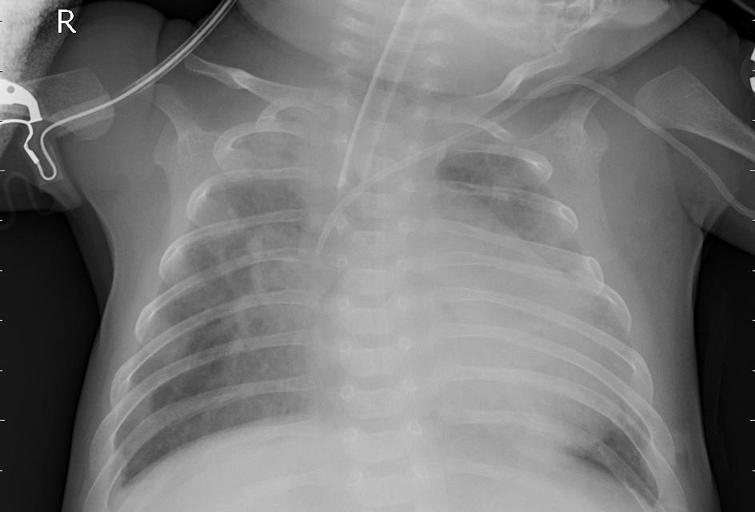
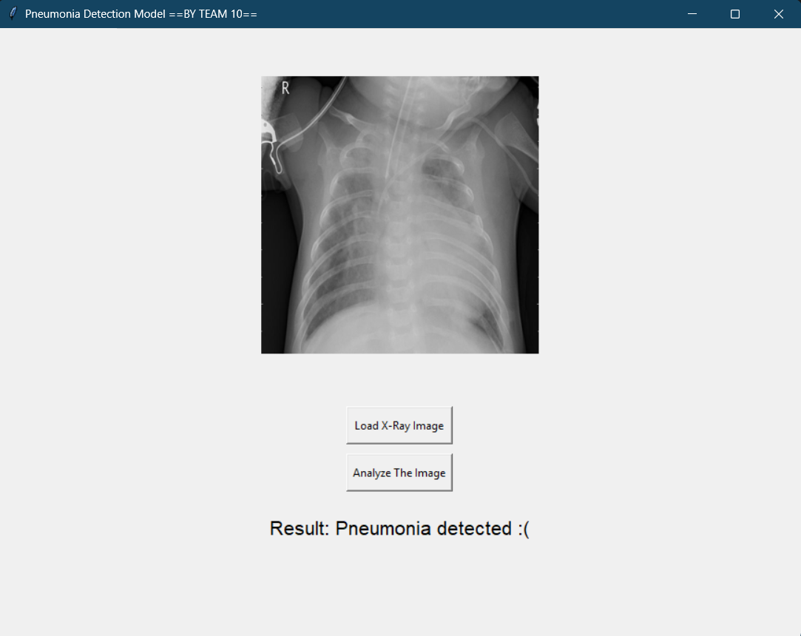
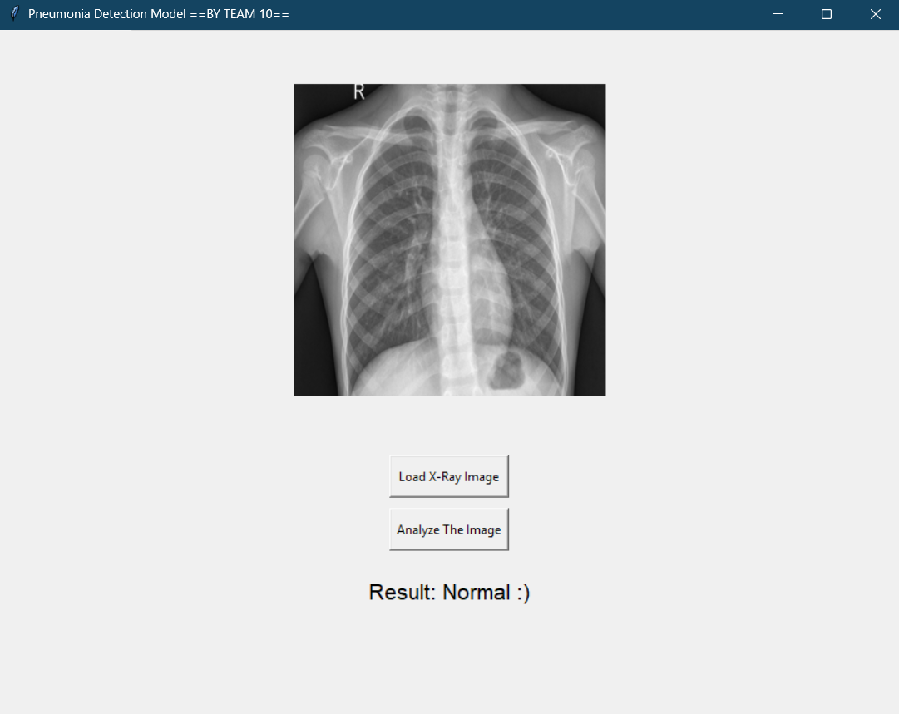

# Pneumonia Detection in Chest X-Rays using Deep Learning 🩺📸

## 🚀 Project Overview

This project develops a deep learning model using **PyTorch** to classify chest X-ray images into two categories:\
✅ **Normal**\
❌ **Pneumonia**

The model is built on **ResNet18**, a pretrained convolutional neural network (CNN), and fine-tuned for pneumonia detection. It achieves an accuracy of **\~96%** on the test dataset. The project applies **data augmentation, dropout regularization, and learning rate scheduling** to improve generalization and prevent overfitting.

---

## 📂 Dataset

We used chest X-ray datasets from **Kaggle**, combining multiple sources to ensure diversity, robustness, and overcome unbalanced classes. The images were manually sorted into two classes:

- **Normal**: Healthy lung X-ray images
- **Pneumonia**: X-rays indicating pneumonia infection

📌 **Dataset Sources:**

- [Chest X-ray (Covid-19 & Pneumonia)](https://www.kaggle.com/datasets/prashant268/chest-xray-covid19-pneumonia)
- [Pneumonia X-Ray Images](https://www.kaggle.com/datasets/pcbreviglieri/pneumonia-xray-images)
- [Chest X-Ray Images (Pneumonia)](https://www.kaggle.com/datasets/paultimothymooney/chest-xray-pneumonia)

---

## 🏰 Model Architecture

We utilize a **pretrained ResNet18** model, modifying its final classification layer for binary classification:

- **Base Model:** ResNet18 (pretrained on ImageNet)
- **Final Layer:** Fully Connected Layer → `nn.Linear(model.fc.in_features, 2)`
- **Activation Function:** Softmax
- **Optimizer:** Adam (`lr=0.001`, `weight_decay=1e-4`)
- **Loss Function:** Cross-Entropy Loss

🔹 **Regularization Techniques Applied:**\
👉 **Dropout (0.5)** in the final layer\
👉 **Data Augmentation:** Random Rotation, Gaussian Blur, Horizontal Flip\
👉 **Learning Rate Decay:** StepLR (reducing learning rate every 7 epochs)

---

## 🏅 Training the Model

- The model undergoes 20 epochs,
- and the number of images processed in each iteration (batch_size) is 32 images.

---

## 📊 Model Evaluation

Evaluate the trained model on the test set of Chest X-Ray Images (Pneumonia) dataset:

- **Train-Test Accuracy Curve:**

- **Classification Report:**

- **Confusion Matrix:**

---

## 🎨 Example Predictions

👉 **Inputs:**

- Normal:

- Pneumonia:

👉 **Outputs:**

